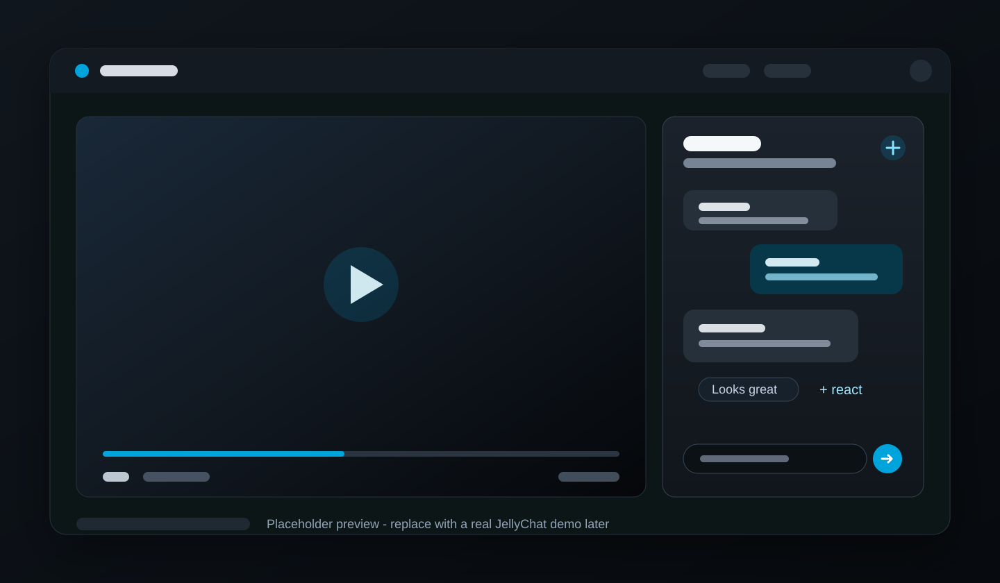

# JellyChat

**Watch together. Chat in sync.**

A native-feeling watch party chat for Jellyfin SyncPlay.



JellyChat adds a compact chat drawer to Jellyfin Web for people watching together in SyncPlay. It stays inside Jellyfin, uses the active SyncPlay room as the chat room, and does not require a separate chat server, WebSocket service, or extra network port.

## Features

- SyncPlay room chat with messages, replies, copy actions, and jump-to-original highlights.
- Floating emoji reactions for quick watch-party feedback.
- Playback activity rows for local play, pause, seek, and start events.
- Typing presence and unread/activity indicators while the drawer is closed.
- Native-feeling Jellyfin trigger placement in the header or video controls when available.
- Resizable desktop drawer with side and background preferences.
- Phone portrait bottom sheet layout, tablet-friendly touch targets, and Jellyfin Desktop fallback behavior.
- Self-contained Jellyfin Web injection through JellyChat-owned middleware and same-origin plugin asset endpoints.

## Installation

Install JellyChat through the Jellyfin plugin catalog by adding this plugin repository:

```text
Dashboard -> Plugins -> Repositories -> Add
```

```text
Repository Name: JellyChat
Repository URL: https://raw.githubusercontent.com/itsmeares/jellychat/main/manifest.json
```

Save the repository, install `JellyChat` from the catalog, then restart Jellyfin.

JellyChat targets Jellyfin `10.11.x` with target ABI `10.11.0.0`.

## Manual Install

Use the repository install when possible. For manual installs, download the release zip from the [latest GitHub release](https://github.com/itsmeares/jellychat/releases/latest), extract it into a Jellyfin plugin folder named `JellyChat`, then restart Jellyfin.

Common plugin folder locations include:

```text
Windows: C:\ProgramData\Jellyfin\Server\plugins\JellyChat
Linux:   /var/lib/jellyfin/plugins/JellyChat
macOS:   ~/.local/share/jellyfin/plugins/JellyChat
```

Use the plugin directory for your Jellyfin server data path if it differs.

## Usage

1. Start playback in Jellyfin Web.
2. Join or create a SyncPlay group.
3. Open JellyChat from the Jellyfin header or video controls.
4. Send messages, reply to recent messages, react with emoji, and keep watching.

JellyChat follows the current SyncPlay room. If you leave the room or Jellyfin cannot resolve the current session, the composer explains that chat is waiting for an active SyncPlay group.

## Client Behavior and Compatibility

### All of the clients below are tested and supported by JellyChat

- **Web:** JellyChat runs inside Jellyfin Web and mounts into native header or video controls when Jellyfin exposes a suitable host.
- **Desktop:** Jellyfin Desktop uses the same injected web client, with a Desktop-safe trigger fallback and video-control insets when needed.
- **Tablet:** The drawer keeps touch targets large enough for iPad-sized layouts while preserving the desktop-style chat surface.
- **Phone landscape:** The drawer uses the compact mobile side layout so chat stays accessible without taking over the player.
- **Phone portrait:** JellyChat switches to a bottom sheet so chat does not interrupt screen use in main menu.

Native Jellyfin clients that do not use Jellyfin Web are not separate JellyChat targets.

## Documentation

- [Development](docs/development.md): repo layout, frontend build, .NET publish, local deploy, and debug commands.
- [Release](docs/release.md): version bump, build, zip packaging, GitHub release asset, and manifest update flow.
- [Troubleshooting](docs/troubleshooting.md): missing button, cross-device messages, SyncPlay resolution, reverse proxy/base-path checks, and `window.JellyChatDebug`.

## Acknowledgements

JellyChat started as a fork of [AbhayVAshokan/jellyfin-syncplay-chat](https://github.com/AbhayVAshokan/jellyfin-syncplay-chat), the original Syncplay Chat plugin for Jellyfin.

This project has since been renamed, refactored, and extended with a JellyChat-owned room event backend, a React/Vite injected frontend, self-contained Jellyfin Web injection, and Jellyfin Web layout work for desktop, tablet, and phone viewing.

Thanks to the original Syncplay Chat project for providing the starting point.

## License

This repository includes a GPL-3.0 license file. If GPL-3.0 terms apply to your distribution, distribute JellyChat under GPL-3.0 and preserve the required notices.
